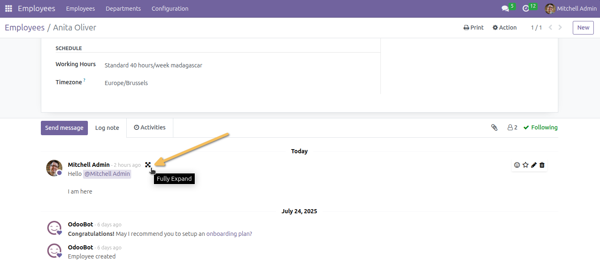
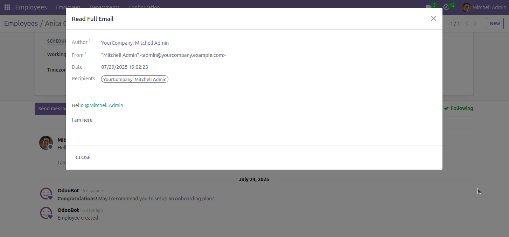

================
Mail full expand
================

This module was written to extend the functionality of messaging to support
expanding messages in a big window and allow you to read its full content.

Odoo automatically tries to remove blockquotes and signatures from received
mails. That is useful because it removes lots of distraction, but sometimes it
removes important information.

Also, messages are narrow to fit in the conversations views, but sometimes you
receive a mail with predefined width and cannot read it.

This module adds a button to all messages to read them in a floating window
with their full contents.

Usage
=====

To use this module, you need to:

* Go to any view with a message thread.
* Click the *Fully expand* button (two arrows indicating separate directions).

Contributors
------------

* The `Numigi <https://numigi.com/r/home>`_ team is the contributor to this project. We help Quebec companies implement Odoo and Konvergo ERP.
* The Odoo Community Association (OCA).